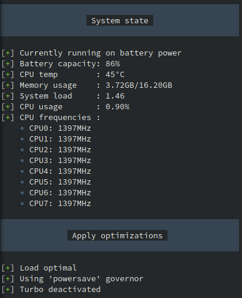

# YABLO
**Y**et **A**nother **B**attery **L**ife **O**ptimizer for Linux 🐧

Yablo reduces the energy consumption of the CPU by automatically setting the CPU governor and Turbo Boost dependend on the battery state and system load.
It is highly inspired by [auto-cpufreq](https://github.com/AdnanHodzic/auto-cpufreq).
The application is written in Rust.




### Features
- automatically sets CPU governor dependend on battery state and load
- automatically activates or deactivates Turbo Boost dependend on battery state and load
- saves energy by reducing the power consumption by the CPU

### CLI
Available flags
- `-d`, `--debug`:  Shows debug/system info
- `-h`, `--help`: Prints help information
- `-l`, `--live`: Prints information and applies suggested CPU optimizations
- `--log`: View live CPU optimization log made by daemon
- `-m`, `--monitor`: Suggests CPU optimizations for the current load
- `-V`, `--version`: Prints version information

## Config

The configuration file is stored at `/etc/yablo/config.toml`.
It allows setting the following parameters separately for the battery states `plugged in` and `on battery`
- `governor` (*String*): sets the default governor for low system load
- `turbo` (*Bool*): allows disabling Turbo Boost to save energy
- `second_stage_governor` (*String*): sets a different governor for high system load or CPU usage. Can be used to compensate for a disabled turbo boost when running on battery (optional, default: `powersave` or `performance` dependend on battery state)
- `turbo_delay` (*Integer*): sets the delay in seconds before the Turbo gets activated (optional, default: 0)

Default config:
```toml
# /etc/yablo/config.toml
[plugged_in]
governor = "performance"
turbo = true

[on_battery]
governor = "powersave"
turbo = true

```